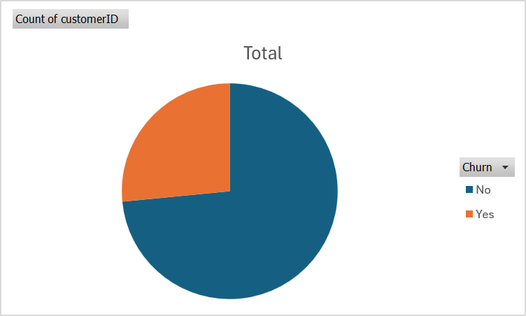
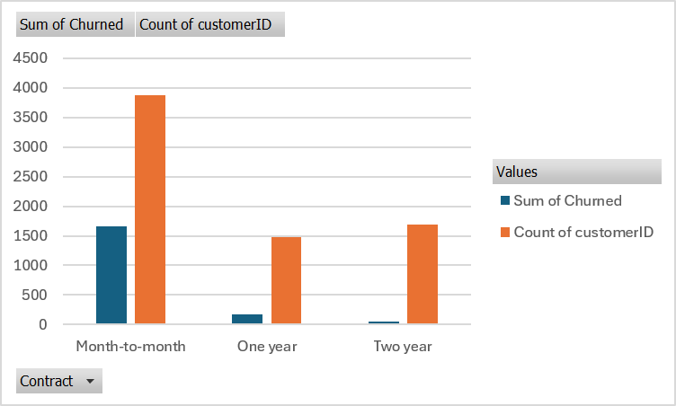
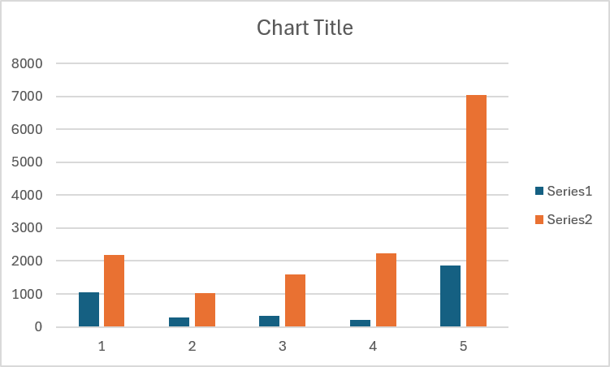
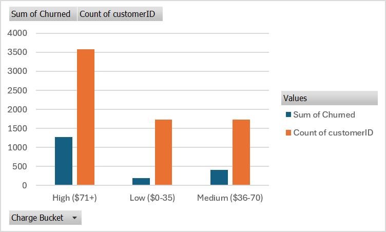

# 📉 Customer Retention & Churn Analysis

An end-to-end churn analysis project built in Excel, using the Telco Customer Churn dataset (7,043 customers) to identify why customers leave, which segments carry the highest risk, and what actions can improve retention.

This project was completed as part of a data analytics internship task, simulating real work done by product, growth, and retention analysts at SaaS and subscription businesses.

---

## 🎯 Project Objective

Help a subscription business answer key questions:
- Why are customers leaving the platform?
- Which customer segments are most likely to churn?
- How long do customers typically stay active before churning?
- What actions can meaningfully improve retention?

---

## 🗂️ Repository Structure

```
Churn-Analysis/
├── raw-data/
│   └── Telco-Customer-Churn.csv        # Original, unmodified dataset
├── cleaned-data/
│   └── Churn_Cleaned.xlsx              # Cleaned data + helper columns (Churned, Tenure Group, Charge Bucket)
├── dashboard/
│   └── Churn_Dashboard.xlsx            # PivotTables + PivotCharts (Excel dashboard)
├── report/
│   └── Churn_Analysis_Report.docx      # Client-ready written report with charts & recommendations
├── screenshots/
│   ├── overall_churn.png
│   ├── churn_by_contract.png
│   ├── churn_by_tenure.png
│   └── churn_by_charges.png
└── README.md
```

---

## 🛠️ Tools Used

- **Microsoft Excel** — data cleaning (Text to Columns, table structuring), PivotTables, PivotCharts
- **Excel formulas** — `IFS()` / nested `IF()`, custom Churned flag and cohort bucketing logic

---

## 🧹 Data Cleaning Steps

1. Converted raw CSV into a structured Excel Table (`ChurnData`)
2. Checked for and confirmed no duplicate records
3. Fixed the `TotalCharges` column — stored as text with ~11 rows containing a blank space instead of a number (all customers with 0 tenure); corrected to `0` and converted the column to numeric
4. Verified no missing values across key fields (`tenure`, `MonthlyCharges`, `TotalCharges`, `Contract`, `Churn`)
5. Added helper columns for analysis:
   - `Churned` — binary flag (`1`/`0`) derived from the `Churn` column
   - `Tenure Group` — bucketed into 0–12 / 13–24 / 25–48 / 49+ months
   - `Charge Bucket` — bucketed into Low ($0–35) / Medium ($36–70) / High ($71+)

---

## 📈 Key Insights

### 1. Overall churn rate is high: 26.5%
Roughly 1 in 4 customers churn — well above the single-digit to low-teens rate considered healthy for a subscription business.



**Recommendation:** Treat churn reduction as a company-wide priority. The segments below show exactly where to focus.

---

### 2. Contract type is the strongest predictor of churn
Month-to-month customers churn at **42.7%** — nearly 15x the rate of two-year contract customers (**2.8%**). Month-to-month is also the largest customer segment, so it drives the majority of total churn.



**Recommendation:** Offer stronger incentives (discounts, loyalty perks, bundled features) to convert month-to-month customers into 1-year or 2-year contracts, especially once they pass the 6–12 month mark.

---

### 3. The first year is the highest-risk period
**47.4%** of customers with 0–12 months tenure churn, compared to just **9.5%** of customers with 49+ months tenure — a 5x drop in risk over the customer lifetime.



**Recommendation:** Invest in a structured onboarding and engagement program for the first 90–180 days, when churn risk is highest.

---

### 4. Higher-paying customers churn more
Customers paying **$71+/month** churn at **35.4%**, more than 3x the rate of customers paying under $35/month (**10.9%**) — likely reflecting dissatisfaction with premium or bundled services rather than price alone.



**Recommendation:** Investigate service quality and satisfaction specifically within the high-charge segment.

---

### 5. Payment method is a major, actionable churn signal
Customers paying by **electronic check** churn at **45.3%** — nearly 3x the rate of any automatic payment method (15–19%). Electronic check is also the single largest payment segment.

| Payment Method | Customers | Churn Rate |
|---|---|---|
| Electronic check | 2,365 | **45.3%** |
| Mailed check | 1,612 | 19.1% |
| Bank transfer (automatic) | 1,544 | 16.7% |
| Credit card (automatic) | 1,522 | 15.2% |

**Recommendation:** Run a targeted campaign encouraging electronic-check customers to switch to autopay, using a small discount or credit as an enrollment incentive — one of the simplest, highest-leverage retention levers available.

---

## ✅ Summary of Recommendations

| Priority | Action | Target Segment |
|---|---|---|
| 1 | Incentivize contract upgrades (month-to-month → 1-year/2-year) | Month-to-month customers, especially post 6–12 months |
| 2 | Build a structured first 90–180 day onboarding program | New customers (0–12 months tenure) |
| 3 | Run an autopay enrollment campaign | Electronic check payers |
| 4 | Audit service quality for premium/high-charge plans | High-charge customers ($71+) |
| 5 | Build a compounded churn-risk score combining contract, tenure, and payment method | All customers, for proactive outreach |

---

## 📄 Full Report

The complete client-ready report — with executive summary, all charts, data tables, and detailed recommendations — is available here:
👉 [`report/Churn_Analysis_Report.docx`](report/Churn_Analysis_Report.docx)

---

## 🧠 What I Learned

- How to clean subscription/customer data, including handling a hidden data-quality issue (space characters masquerading as blanks)
- Building cohort-style buckets (tenure groups, charge brackets) using `IFS()` for segmentation analysis
- How to calculate and interpret churn rate across multiple dimensions using PivotTables
- Why churn drivers compound — new + month-to-month + high-charge + manual payment together define the highest-risk customer profile
- Turning churn metrics into a clear business narrative: observation → why it matters → recommendation

---

## 📬 Connect

If you're a founder, product manager, or fellow analyst and want to discuss this project or a similar retention analysis for your own data, feel free to reach out on [LinkedIn](#).

*Dataset source: [Telco Customer Churn Dataset (Kaggle)](https://www.kaggle.com/datasets/blastchar/telco-customer-churn)*
